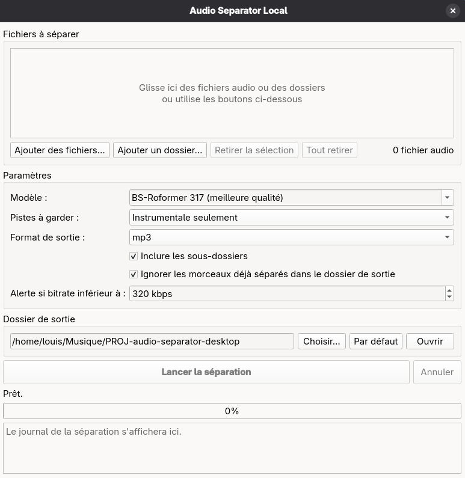

# Audio Separator Local



Petite application graphique pour séparer la voix et l'instrumentale de fichiers audio,
en local et sur GPU, grâce à [audio-separator](https://github.com/nomadkaraoke/python-audio-separator).

- Glisser-déposer de fichiers ou de dossiers (avec ou sans sous-dossiers)
- Choix du modèle, des pistes à garder et du format de sortie
- Suivi de l'avancement : nombre de fichiers détectés, morceau en cours (X/Total) et
  barre de progression pendant le traitement d'un dossier, résumé final (réussis/ignorés/erreurs)
- Sortie par défaut dans `~/Musique/PROJ-audio-separator-desktop`

## Prérequis

- Linux (testé sur Fedora 44) ou Windows
- GPU NVIDIA recommandé (fonctionne aussi sur CPU, beaucoup plus lentement)
- `uv` et `ffmpeg`

## Installation (Fedora)

```bash
sudo dnf install uv ffmpeg-free
git clone <url-du-depot> PROJ-audio-separator-desktop
cd PROJ-audio-separator-desktop
./install.sh
```

L'application apparaît ensuite dans les Activités.

## Lancer depuis le terminal

```bash
uv run PROJ-audio-separator-desktop
```

## Désinstaller

```bash
./uninstall.sh
```

Les modèles téléchargés sont stockés dans `~/.cache/audio-separator-models`.

## Rendre les scripts exécutables

Sous Linux, si `./install.sh` ou `./uninstall.sh` renvoie une erreur de permission :

```bash
chmod +x install.sh uninstall.sh
```
